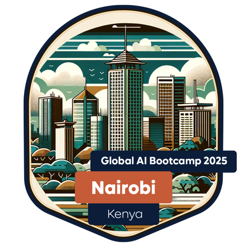
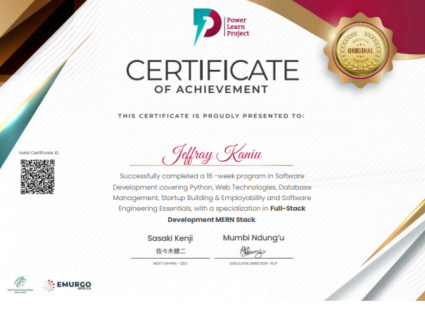
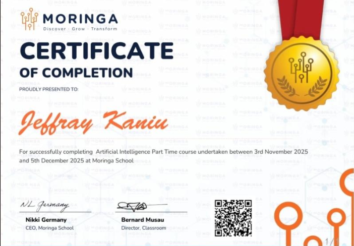

<!--Banner-->
<!--[Kanew Banner Image](/images/banner.png)-->

<!--Night Owl image-->

  

<!--Header Name-->
#  ɪ'ᴍ ᴋᴀɴᴇᴡ
*(Software Engineer · AI Systems Builder)*
 

<!--Start Intro-->

I am a Computer Science student and software engineer who enjoys building practical, intelligent systems.
My work spans full-stack web development, AI-powered platforms, and applied problem-solving — with a strong preference for clarity, reliability, and solutions that ship.

- ✨ Builder by mindset, student by title
- 🌱 Currently deepening my knowledge in AI systems, RAG architectures, and backend scalability
- 🧠 Strong interest in applied Machine Learning and Natural Language Processing
- 🏆 Hackathon winner (Most Innovative Project – twice)
- 🎓 National-level finalist, Huawei ICT Competition (computing Track)
- 💻 Explore my work on GitHub and selected live projects
- 💻 Visit my [Portfolio](https://kaniujeffray.me) for more details about me.

<!--End Intro-->

<!--Profile Count Badge-->

  

---

<!--Languages and Tools Section-->
<h2 align="center">Tᴇᴄʜ sᴛᴀᴄᴋ & Cᴜʀʀᴇɴᴛ Fᴏᴄᴜs</h2>

<!--<picture>
  <source media="(prefers-color-scheme: dark)" srcset="./Skills_Animation_Dark.gif">
  <source media="(prefers-color-scheme: light)" srcset="./Skills_Animation_White.gif">
  
</picture>
 -->

   
   
   
   
   
   
  
   
   

<h3 align="left">Core Technologies</h3>
<ul align="left">
  <li><strong>Languages:</strong> Python, JavaScript, TypeScript, SQL</li>
  <li><strong>Frameworks:</strong> React, Next.js, Node.js (Express), FastAPI, Flask</li>
  <li><strong>Databases:</strong> MongoDB, Firebase (Firestore), MySQL</li>
  <li><strong>AI & Data:</strong> RAG, NLP, OpenAI API, Vector Search</li>
  <li><strong>Tools:</strong> Git, GitHub, Docker (fundamentals), Vercel</li>
</ul>

<h3 align="left">Current Learning</h3>
<ul align="left">
  <li>Designing scalable AI systems using Retrieval-Augmented Generation.</li>
  <li>Improving backend performance and API architecture.</li>
  <li>Building intelligent agents that integrate cleanly with real products.</li>
</ul>

 

### 🏅 Badges & Certifications 

 
   
   
   
   
  
  

 
<!--Trophies Section-->
<h2 align="center">🏆 Gɪᴛʜᴜʙ Aᴄʜɪᴇᴠᴇᴍᴇɴᴛs 🏆</h2>

  <a href="https://github.com/wenakanew">
    <picture>
      <source media="(prefers-color-scheme: dark)" srcset="https://github-profile-trophy-ruddy.vercel.app/?username=wenakanew&no-bg=true&row=2&column=6&margin-w=20&margin-h=20&theme=monokai">
      <source media="(prefers-color-scheme: light)" srcset="https://github-profile-trophy-ruddy.vercel.app/?username=wenakanew&no-bg=true&row=2&column=6&margin-w=20&margin-h=20">
      
    </picture>
  </a>

 

<!--Github stats Table-->
<h2 align="center">📊 Gɪᴛʜᴜʙ Sᴛᴀᴛs 📊</h2>

<table width="100%">
  <tr>
    <td width="50%">
      <h3 align="center"><strong>Gɪᴛʜᴜʙ Sᴛᴀᴛs</strong></h3>
      

        
      

    </td>
    <td width="50%">
      <h3 align="center"><strong>Sᴛʀᴇᴀᴋ Sᴛᴀᴛs</strong></h3>
      

        <a href="https://github.com/wnakanew">
        
      

    </td>
  </tr>
  <tr>
    <td width="50%">
      <h3 align="center"><strong>Lᴀᴛᴇsᴛ Pʀᴏᴊᴇᴄᴛ</strong></h3>
      

        
      

    </td>
    <td width="50%">
      <h3 align="center"><strong>Tᴏᴘ Cᴏɴᴛʀɪʙᴜᴛɪᴏɴs</strong></h3>
      

        
      

    </td>
  </tr>
</table>

 

<!--Contribution Graph-->
<h2 align="center">📈 Cᴏɴᴛʀɪʙᴜᴛɪᴏɴ Gʀᴀᴘʜ 📈</h2>

  

---

<!--Quote-->
<h2 align="center">🌟 Tʜᴏᴜɢʜᴛ ᴏғ ᴛʜᴇ Dᴀʏ 🌟</h2>

  

---

<!--Contact Section-->
<h2 align="center">🤝 Cᴏɴɴᴇᴄᴛ Wɪᴛʜ Mᴇ 🤝</h2>

 

<!--Footer-->

  

